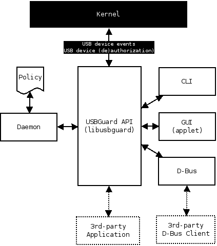

<!-- START doctoc generated TOC please keep comment here to allow auto update -->
<!-- DON'T EDIT THIS SECTION, INSTEAD RE-RUN doctoc TO UPDATE -->
**Table of Contents**  *generated with [DocToc](https://github.com/thlorenz/doctoc)*

- [USBGuard](#usbguard)
  - [Component View](#component-view)
  - [Use Cases](#use-cases)
    - [Use case #1: USB device whitelisting](#use-case-1-usb-device-whitelisting)
    - [Use case #2: USB device blacklisting](#use-case-2-usb-device-blacklisting)
    - [Use case #3: Triggering actions on USB device events](#use-case-3-triggering-actions-on-usb-device-events)
  - [Supported Operating Systems](#supported-operating-systems)
    - [Portability](#portability)
  - [Compilation](#compilation)
  - [OS packages](#os-packages)
    - [Fedora Linux, RHEL or CentOS](#fedora-linux-rhel-or-centos)
    - [Gentoo](#gentoo)
    - [Arch Linux](#arch-linux)
    - [Debian](#debian)
    - [Usage](#usage)
  - [Rule Language](#rule-language)
    - [Targets](#targets)
    - [Device Specification](#device-specification)
      - [Device Attributes](#device-attributes)
    - [Conditions](#conditions)
  - [Initial policy](#initial-policy)
  - [Example policies](#example-policies)
    - [Allow USB mass storage devices (USB flash disks) and block everything else](#allow-usb-mass-storage-devices-usb-flash-disks-and-block-everything-else)
    - [Allow a specific Yubikey device to be connected via a specific port. Reject everything else on that port.](#allow-a-specific-yubikey-device-to-be-connected-via-a-specific-port-reject-everything-else-on-that-port)
    - [Reject devices with suspicious combination of interfaces](#reject-devices-with-suspicious-combination-of-interfaces)
    - [Allow a keyboard-only USB device only if there isn't already a USB device with a keyboard interface allowed](#allow-a-keyboard-only-usb-device-only-if-there-isnt-already-a-usb-device-with-a-keyboard-interface-allowed)
    - [Play "Russian roulette" with USB devices](#play-russian-roulette-with-usb-devices)
  - [License](#license)

<!-- END doctoc generated TOC please keep comment here to allow auto update -->

# USBGuard

USBGuard is a software framework for implementing USB device authorization policies (what kind of USB devices are authorized) as well as method of use policies (how a USB device may interact with the system).

**WARNING**: The 0.x releases are not production ready packages. They serve for tech-preview and user feedback purposes only. Please share your feedback or request a feature in the Github issue trackers for each project:

 * [Report a bug or request a feature in **usbguard**](https://github.com/dkopecek/usbguard/issues/new)

## Component View

## Use Cases

### Use case #1: USB device whitelisting
A  desktop user usually has a quite stable set of USB devices he uses. The set consists of internally and externally connected devices. From a security point of view, it’s good to limit the usage of the computer’s USB ports to these devices only with some temporary exceptions (connecting a third-party’s USB disk to our system to transfer data   from/to it).

USBGuard  can lockdown the system and permit only known devices to create interfaces to it via USB. It is possible to bypass this  protection by  emulating the devices on the whitelist. However, this requires the knowledge of the contents of such list and for devices which export a  unique serial number, it’s even harder as one needs to know this serial  number to successfully emulate the device.

Reprogramming  attacks ([BadUSB](https://srlabs.de/badusb/)) which change the type of the device or add a hidden/unexpected interface to the device (a USB keyboard/network card  interface on a USB flash disk) will change the attributes of the  device and it will no longer match the whitelist.

Allowing to attach any USB device to the system exposes it to exploitation of bugs in USB interface drivers in the kernel.

### Use case #2: USB device blacklisting
The USB protocol uses a classification system for the various types  of  interfaces a USB device can provide. If a user doesn't want to use a particular class of interfaces, he can block devices that want to communicate with the computer as an interface from that class.

### Use case #3: Triggering actions on USB device events
The project makes possible to easily implement triggering of various actions when a particular USB device or USB device class is inserted, removed, etc. This feature might be used for example for auditing USB usage, screen locking (per-user via applet), etc.

## Supported Operating Systems

Currently, USBGuard works only on Linux. To enforce the user-defined policy, it uses the USB device authorization feature
implemented in the Linux kernel since the year 2007. Read [this document](https://www.kernel.org/doc/Documentation/usb/authorization.txt)
if you want to know more.

### Portability

Although the primary target and development platform of this project is Linux, the code aims to be portable to other operating systems as well. Internally, the USBGuard daemon tries to abstract USB device handling as much as possible and for this purpose it uses two base classes that define the interface which the daemon uses for interacting with USB devices. A USB device is represented by the `usbguard::Device` class. The seconds class, `usbguard::DeviceManager`, defines an interface for USB device discovery and authorization. Please refer to the `usbguard::LinuxDevice` and `usbguard::LinuxDeviceManager` classes for an example implementation. More detailed documentation will be added as soon as possible.

## Compilation

If you want to compile the sources from a release tarball, you'll have to install development files for:

 * [libqb](https://github.com/ClusterLabs/libqb) - used for local UNIX socket based IPC
 * [protobuf](https://github.com/google/protobuf) - used for IPC message (de)serialization
 * [libsodium](http://libsodium.org) or [libgcrypt](https://www.gnupg.org/software/libgcrypt)- used for hashing

Optionally, you may want to install:

 * [libseccomp](https://github.com/seccomp/libseccomp) - used to implement a syscall whitelist
 * [libcap-ng](https://people.redhat.com/sgrubb/libcap-ng/) - used to drop process capabilities

And then do:

    $ ./configure
    $ make
    $ sudo make install

After the sources are successfully built, you can run the test suite by executing:

    $ make check

If you want to compile the sources in a cloned repository, you'll have to run the `./autogen.sh` script which will fetch the sources (git submodules) of [PEGTL](https://github.com/taocpp/PEGTL/) and [Catch](https://github.com/philsquared/Catch) which are used in this project too. The script will then initialize the autoconf & automake based build system.

## OS packages

### Fedora Linux, RHEL or CentOS

Precompiled packages for Fedora and EPEL (RHEL, CentOS, ...) are distributed via a Copr [repository](https://copr.fedoraproject.org/coprs/mildew/usbguard/).
You can install the repository by executing the following steps:

    $ sudo yum install yum-plugin-copr
    $ sudo yum copr enable mildew/usbguard
    $ sudo yum install usbguard
    $ sudo yum install usbguard-applet-qt

Use `dnf` instead of `yum` if you are on a Fedora based system.

### Gentoo

For Gentoo you can use the [stuge overlay](https://github.com/das-labor/labor-overlay) via layman:

    $ layman -f -o https://raw.github.com/das-labor/labor-overlay/master/labor-overlay -a labor-overlay
    $ emerge -av usbguard

### Arch Linux

For Arch Linux there are two packages in AUR:
- regular releases: [usbguard](https://aur.archlinux.org/packages/usbguard/)
- latest commit: [usbguard-git](https://aur.archlinux.org/packages/usbguard-git/)

### Debian

For Debian, a package is available in the stable distribution: [usbguard](https://packages.debian.org/stable/utils/usbguard).

### Usage

A quick way to start using USBGuard on your system is to follow these steps:

  1. Generate a [policy](#initial-policy) for your system.
  2. Start the usbguard-daemon (`systemctl start usbguard.service`).

Additionally, you can use the usbguard desktop applet (`usbguard-applet-qt`) but since this applet is going to run from the desktop session, i.e. non-root user, you'll have to enable USBGuard IPC access for that user. By default, access to the IPC is allowed only to the `root` user. Adding users or groups can be done via the usbguard CLI. For example, if you want user `joe` to be able to use the desktop applet, run:

    # usbguard add-user joe --devices ALL --exceptions ALL

## Rule Language

The USBGuard daemon decides which USB device to authorize based on a policy defined by a set of rules. When a USB device is inserted into the system, the daemon scans the existing rules sequentially and when a matching rule is found, it either authorizes (**allows**), deauthorizes (**blocks**) or removes (**rejects**) the device, based on the rule target. If no matching rule is found, the decision is based on an implicit default target. This implicit default is to block the device until a decision is made by the user. The rule language grammar, expressed in a BNF-like syntax, is the following:

    rule ::= target attributes.

    target ::= "allow" | "block" | "reject".

    attributes ::= attributes | attribute.
    attributes ::= .

Rule attributes specify which devices to match or what condition have to be met for the rule to be applicable. See the [Device Attributes](https://github.com/dkopecek/usbguard#device-attributes) section for the list of available attributes and [Conditions](https://github.com/dkopecek/usbguard#conditions) for the list of supported rule conditions.

### Targets

The target of a rule specifies whether the device will be authorized for use or not. Three types of target are recognized:

 * *allow* -- **Authorize** the device. The device and its interfaces will be allowed to communicate with the system.
 * *block* -- **Deauthorize** the device, i.e. don't talk to the device for now.
 * *reject* -- **Remove** the device from the system, i.e. ignore the device as if it didn't exist.

### Device Specification

Except the target, all the other fields of a rule need not be specified. Such a minimal rule will match any device and allows the policy creator to write an explicit default target. If no rule from the policy is applicable to the device, an implicit target configured in **usbguard-daemon.conf**(5) will be used. However, if one wants to narrow the applicability of a rule to a set of devices or one device only, it's possible to do so with device attributes and rule conditions.

#### Device Attributes

Device attributes are specific values read from the USB device after it's inserted to the system. Which attributes are available is defined below. Some of the attributes are derived and some are based on attributes read directly from the device. All attributes support two forms:

 * single-valued with a syntax `name value`
 * multi-valued with a syntax `name [operator] { value1 value2 ... }`

where the optional *operator* is one of:

 * *all-of* -- The device attribute set must contain all of the specified values for the rule to match.
 * *one-of* -- The device attribute set must contain at least one of the specified values for the rule to match.
 * *none-of* -- The device attribute set must not contain any of the specified values for the rule to match.
 * *equals* -- The device attribute set must contain exactly the same set of values for the rule to match.
 * *equals-ordered* -- The device attribute set must contain exactly the same set of values in the same order for the rule to match.

If the operator is not specified it is set to *equals*.

List of attributes:

* **id** `usb-device-id`
:   Match a USB device ID.
* **id** `[operator] { usb-device-id ... }`
:   Match a set of USB device IDs.
* **hash** `"value"`
:   Match a hash computed from the device attribute values and the USB descriptor data. The hash is computed for every device by USBGuard.
* **hash** `[operator] { "value" ... }`
:   Match a set of device hashes.
* **parent-hash** `"value"`
:   Match a hash of the parent device.
* **parent-hash** `[operator] { "value" ... }`
:   Match a set of parent device hashes.
* **name** `"device-name"`
:   Match the USB device name attribute.
* **name** `[operator] { "device-name" ... }`
:   Match a set of USB device names.
* **serial** `"serial-number"`
:   Match the USB iSerial device attribute.
* **serial** `[operator] { "serial-number" ... }`
:   Match a set of USB iSerial device attributes.
* **via-port** `"port-id"`
:   Match the USB port through which the device is connected. Note that some systems have unstable port numbering which change after the system reboots or certain kernel modules are reloaded (and maybe in other cases). Use the **parent-hash** attribute if you want to ensure that a device is connected via a specific parent device.
* **via-port** `[operator] { "port-id" ... }`
:   Match a set of USB ports.
* **with-interface** `interface-type`
:   Match an interface type that the USB device provides.
* **with-interface** `[operator] { interface-type interface-type ... }`
:   Match a set of interface types against the set of interfaces that the USB device provides.

The *usb-device-id* is a colon delimited pair in the form **vendor\_id:product\_id**. All USB devices have this ID assigned by the manufacturer and it should uniquely identify a USB product. Both **vendor\_id** and **product\_id** are 16-bit numbers represented in hexadecimal base. It's possible to use an asterisk character to match either any device ID `*:*` or any product ID from a specific vendor, e.g. `1234:*`.

The *port-id* value is a platform specific USB port identification. On Linux it's in the form of "usbN" in case of a USB controller (more accurately a "root hub") or "bus-port[.port[.port ...]]" (e.g. "1-2", "1-2.1", ...).

The *interface-type* represents a USB interface and should be formatted as three 8-bit numbers in hexadecimal base delimited by a colon character, i.e. *cc:ss:pp*. The numbers represent the interface class (*cc*), subclass (*ss*) and protocol (*pp*) as assigned by the [USB-IF](http://www.usb.org/about). See the [list of assigned classes, subclasses and protocols](http://www.usb.org/developers/defined_class). Instead of the subclass and protocol number, you may write an asterisk character (`*`) to match all subclasses or protocols. Matching a specific class and a specific protocol is not allowed, i.e. if you use an asterisk as the subclass number, you have to use an asterisk for the protocol too.

### Conditions

Whether a rule that matches a device will be applied or not can be further restricted using rule conditions. If the condition expression is met at the rule evaluation time, then the rule target is applied for the device. A condition expression is met if it evaluates to true. Otherwise, the rule evaluation continues with the next rule. A rule conditions has the following syntax:

     if [!]condition
     if [operator] { [!]conditionA [!]conditionB ... }

Optionally, an exclamation mark (`!`) can be used to negate the result of a condition.

Interpretation of the set operator:

 * `all-of`: Evaluate to true if all of the specified conditions evaluated to true.
 * `one-of`: Evaluate to true if one of the specified conditions evaluated to true.
 * `none-of`: Evaluate to true if none of the specified conditions evaluated to true.
 * `equals`: Same as `all-of`.
 * `equals-ordered`: Same as `all-of`.

List of conditions:

 * `localtime(time_range)`: Evaluates to true if the local time is in the specified time range. `time_range` can be written either as `HH:MM[:SS]` or `HH:MM[:SS]-HH:MM[:SS]`.
 * `allowed-matches(query)`: Evaluates to true if an allowed device matches the specified query. The query uses the rule syntax. **Conditions in the query are not evaluated**.
 * `rule-applied`: Evaluates to true if the rule currently being evaluated ever matched a device.
 * `rule-applied(past_duration)`: Evaluates to true if the rule currently being evaluated matched a device in the past duration of time specified by the parameter. `past_duration` can be written as `HH:MM:SS`, `HH:MM`, or `SS`.
 * `rule-evaluated`: Evaluates to true if the rule currently being evaluated was ever evaluated before.
 * `rule-evaluated(past_duration)`: Evaluates to true if the rule currently being evaluated was evaluated in the pas duration of time specified by the parameter. `past_duration` can be written as `HH:MM:SS`, `HH:MM`, or `SS`.
 * `random`: Evaluates to true/false with a probability of `p=0.5`.
 * `random(p_true)`: Evaluates to true with the specified probability `p_true`.
 * `true`: Evaluates always to true.
 * `false`: Evaluates always to false.

## Initial policy

Using the `usbguard` CLI tool and its `generate-policy` subcommand, you can generate an initial policy for your system instead of writing one from scratch. The tool generates an **allow** policy for all devices connected to the system at the moment of execution. It has several options to tweak the resulting policy:

 * `-p`: Generate port specific rules for all devices. By default, port specific rules are generated only for devices which do not export an iSerial value. See the `-P` option for more details.

 * `-P`: Don't generate port specific rules for devices without an iSerial value. Without this option, the tool will add a `via-port` attribute to any device that doesn't provide a serial number. This is a security measure to limit devices that cannot be uniquely identified to connect only via a specific port. This makes it harder to bypass the policy since the real device will occupy the allowed USB port most of the time.

 * `-t <target>`: Generate an explicit "catch all" rule with the specified target. The target can be one of the following values: `allow`, `block`, `reject`.

 * `-X`: Don't generate a hash attribute for each device.

 * `-H`: Generate a hash-only policy.

The policy will be printed out on the standard output. It's a good idea to review the generated rules before using them on a system. The typical workflow for generating an initial policy could look like this:

    # usbguard generate-policy > rules.conf
    # vi rules.conf
    (review/modify the rule set)
    # sudo install -m 0600 -o root -g root rules.conf /etc/usbguard/rules.conf
    # sudo systemctl start usbguard.service

## Example policies

The following examples show what to put into the `rules.conf` file in order to implement the given policy.

### Allow USB mass storage devices (USB flash disks) and block everything else

This policy will block any device that isn't just a mass storage device. Devices with a hidden keyboard interface in a USB flash disk will be blocked. Only devices with a single mass storage interface will be allowed to interact with the operating system. The policy consists of a single rule:

    allow with-interface equals { 08:*:* }

The blocking is implicit in this case because we didn't write a `block` rule. Implicit blocking is useful to desktop users because a desktop applet listening to USBGuard events can ask the user for a decision if an implicit target was selected for a device.

### Allow a specific Yubikey device to be connected via a specific port. Reject everything else on that port.

    allow 1050:0011 name "Yubico Yubikey II" serial "0001234567" via-port "1-2" hash "044b5e168d40ee0245478416caf3d998"
    reject via-port "1-2"

We could use just the hash to match the device. However, using the name and serial attributes allows the policy creator to quickly assign rules to specific devices without computing the hash. On the other hand, the hash is the most specific value we can use to identify a device in USBGuard so it's the best attribute to use if you want a rule to match just one device.

### Reject devices with suspicious combination of interfaces

A USB flash disk which implements a keyboard or a network interface is very suspicious. The following set of rules forms a policy which allows USB flash disks and explicitly rejects devices with an additional and suspicious (as defined before) interface.

    allow with-interface equals { 08:*:* }
    reject with-interface all-of { 08:*:* 03:00:* }
    reject with-interface all-of { 08:*:* 03:01:* }
    reject with-interface all-of { 08:*:* e0:*:* }
    reject with-interface all-of { 08:*:* 02:*:* }
   
The policy rejects all USB flash disk devices with an interface from the HID/Keyboard, Communications and Wireless classes. Please note that blacklisting is the wrong approach and you shouldn't just blacklist a set of devices and allow the rest. The policy above assumes that blocking is the implicit default. Rejecting a set of devices considered as "bad" is a good approach how to limit the exposure of the OS to such devices as much as possible.

### Allow a keyboard-only USB device only if there isn't already a USB device with a keyboard interface allowed

    allow with-interface one-of { 03:00:01 03:01:01 } if !allowed-matches(with-interface one-of { 03:00:01 03:01:01 })

### Play "Russian roulette" with USB devices

    allow if random(0.1666)
    reject

## License
>
> Copyright (C) 2017 Red Hat, Inc.
>
> This program is free software; you can redistribute it and/or modify
> it under the terms of the GNU General Public License as published by
> the Free Software Foundation; either version 2 of the License, or
> (at your option) any later version.
>
> This program is distributed in the hope that it will be useful,
> but WITHOUT ANY WARRANTY; without even the implied warranty of
> MERCHANTABILITY or FITNESS FOR A PARTICULAR PURPOSE.  See the
> GNU General Public License for more details.
>
> You should have received a copy of the GNU General Public License
> along with this program.  If not, see <http://www.gnu.org/licenses/>.
>

